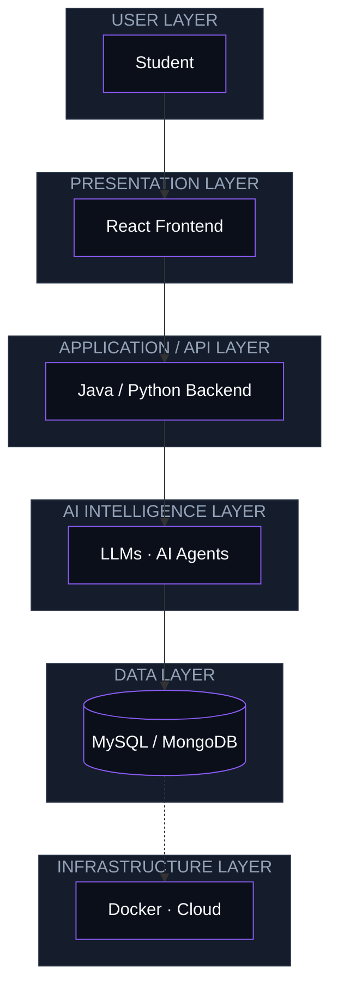

<!--
  AURORA NEON — Developer Edition
  Background #0B0F19 | Card #151C2B | Border #263244
  Violet #8B5CF6 | Purple #A855F7 | Cyan #22D3EE | Blue #38BDF8 | Pink #F472B6
  Text #F8FAFC | Muted #94A3B8 | Success #34D399
-->

<i>Building practical software, exploring AI, and turning ideas into real-world applications.</i>

  

 

## 👨‍💻 About Me

> **Software developer in progress, focused on Java, Python, DSA, AI and real-world applications.**
> *Build → Learn → Improve → Repeat*

<table width="100%">
<tr>
  <td width="33%" valign="top">🎓 <b>Education</b> Diploma in Computer Science BE in Electronics &amp; Telecommunication Engineering</td>
  <td width="33%" valign="top">💻 <b>Current Focus</b> Building <b>PlacementAI</b>, an AI-powered placement prep platform</td>
  <td width="33%" valign="top">🧠 <b>Learning</b> AI Agents · LLM integration · Scalable backends · Docker</td>
</tr>
<tr>
  <td valign="top">🚀 <b>Building</b> Practical AI applications that solve real problems</td>
  <td valign="top">🤝 <b>Collaboration</b> Java · Python · AI · beginner-friendly open source</td>
  <td valign="top">🎯 <b>Career Goal</b> Software engineering opportunities and placement readiness</td>
</tr>
</table>

 

### 🧩 Developer Snapshot

<table width="100%">
<tr>
  <td width="33%" valign="top"><b>💻 Languages</b> Java Python JavaScript</td>
  <td width="33%" valign="top"><b>🤖 AI / ML</b> LLMs AI Agents Ollama · TensorFlow</td>
  <td width="33%" valign="top"><b>🗄️ Databases</b> MySQL MongoDB Firebase</td>
</tr>
</table>

## 🚀 PlacementAI

### AI-Powered Placement Preparation Platform

**The problem:** students preparing for technical placements juggle separate tools for coding practice, interview prep and guidance. PlacementAI brings **DSA practice**, **interview preparation** and **personalized AI guidance** into one platform.

<table width="100%">
<tr>
  <td width="33%" valign="top">🤖 <b>AI Assistant</b> Placement guidance powered by LLMs</td>
  <td width="33%" valign="top">💻 <b>DSA Practice</b> Coding and problem-solving prep</td>
  <td width="33%" valign="top">🧠 <b>Interview Preparation</b> Technical and HR interview practice</td>
</tr>
<tr>
  <td valign="top">📊 <b>Progress Tracking</b> Track preparation over time</td>
  <td valign="top">🎯 <b>Personalized Learning</b> Learning path adapted to each user</td>
  <td valign="top">🔗 <b>Repository</b> <a href="https://github.com/dineshDevAI">View on GitHub</a><!-- TODO: replace with the direct PlacementAI repo link --></td>
</tr>
</table>

### 🏗️ Architecture

## ⚡ What I'm Building

<table width="100%">
<tr>
  <td valign="top">
    <b>🚀 PlacementAI</b> &nbsp;  
    AI-powered placement preparation platform combining DSA practice, interview prep and personalized guidance.  
    <b>Technology:</b> React · Java / Python · LLMs &amp; AI Agents · MySQL / MongoDB · Docker
  </td>
</tr>
</table>

## 🛠️ Tech Stack

<table width="100%">
<tr>
  <td width="33%" valign="top" align="center"><b>Languages</b>  </td>
  <td width="33%" valign="top" align="center"><b>Frontend</b>  </td>
  <td width="33%" valign="top" align="center"><b>Backend</b>  </td>
</tr>
<tr>
  <td valign="top" align="center"><b>Databases</b>  </td>
  <td valign="top" align="center"><b>AI / ML</b>   </td>
  <td valign="top" align="center"><b>DevOps &amp; Cloud</b>  </td>
</tr>
<tr>
  <td valign="top" align="center" colspan="3"><b>Tools</b>  </td>
</tr>
</table>

## 🎯 Current Focus

| Area | Status |
|---|:-:|
| ☕ **Java &amp; DSA** |  |
| 🤖 **AI Agents** |  |
| 🧠 **LLM Integration** |  |
| ⚙️ **Backend Development** |  |
| 🐳 **Docker** |  |
| 🌐 **Real-world applications** |  |

## 📊 GitHub Analytics

 

 

## 🐍 Contribution Activity

<picture>
  <source media="(prefers-color-scheme: dark)" srcset="https://raw.githubusercontent.com/dineshDevAI/dineshDevAI/output/github-contribution-grid-snake-dark.svg" />
  <source media="(prefers-color-scheme: light)" srcset="https://raw.githubusercontent.com/dineshDevAI/dineshDevAI/output/github-contribution-grid-snake.svg" />
  
</picture>

<i>Consistency compounds. Every contribution is another step forward.</i>

## 🧭 2026 Developer Roadmap

| Phase | Goal | Status |
|:-:|---|:-:|
| **01 · Foundation** | DSA &amp; problem solving |  |
| | Java |  |
| | Python for AI |  |
| **02 · Engineering** | Backend development |  |
| | Docker &amp; deployment |  |
| **03 · AI Engineering** | Practical AI Agent applications |  |
| | LLM integration |  |
| **04 · Production** | Scalable full-stack applications |  |
| | Open-source contributions |  |
| **05 · Career** | Build and grow PlacementAI |  |
| | Become placement-ready |  |

## 🧠 Engineering Philosophy

> **Build → Learn → Improve → Repeat.**

- Build before overthinking.
- Learn by solving real problems.
- Improve through iteration.
- Keep projects practical.

## 🤝 Let's Build Something Useful

Open to software projects, AI experiments, DSA discussions and meaningful collaboration.

 

  

