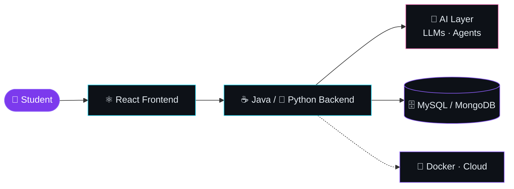

<!--
  PALETTE  "Aurora Neon"
  Background  #0D1117   Surface #161B22   Border #30363D
  Violet      #8B5CF6   Cyan    #22D3EE   Pink   #F472B6
  Text        #E6EDF3   Muted   #8B949E
-->

  

  

 

## 👨‍💻 &nbsp;About Me

> *"Build → Learn → Improve → Repeat."*

I'm **Dinesh Sonawane**, an aspiring software developer who loves building real-world applications at the intersection of **software engineering and AI**. I learn best by shipping projects.

<table>
<tr>
  <td>🔭 <b>Current Focus</b></td>
  <td>Building <b>PlacementAI</b>, an AI-powered placement prep platform</td>
</tr>
<tr>
  <td>🌱 <b>Learning</b></td>
  <td>AI Agents · LLM integration · Scalable backend systems · Docker</td>
</tr>
<tr>
  <td>👯 <b>Collaborate On</b></td>
  <td>Java · Python · AI · beginner-friendly open-source</td>
</tr>
<tr>
  <td>🤝 <b>Looking For</b></td>
  <td>Help with Java, DSA, AI integration &amp; scalable apps</td>
</tr>
<tr>
  <td>💬 <b>Ask Me About</b></td>
  <td>Java · Python · DSA · AI projects · my dev journey</td>
</tr>
<tr>
  <td>📫 <b>Reach Me</b></td>
  <td><a href="mailto:dineshsonawane06565@gmail.com">dineshsonawane06565@gmail.com</a></td>
</tr>
</table>

 

## 🚀 &nbsp;Featured Project

 

An AI-powered platform that helps students prepare for technical placements by combining **DSA practice**, **mock interviews** and **personalized AI guidance**.

| | Feature | What it does |
|:-:|---|---|
| 🤖 | **AI Assistant** | Placement guidance powered by LLMs |
| 💻 | **DSA Practice** | Coding and problem-solving prep |
| 🧠 | **Interview Prep** | Technical and HR interview practice |
| 📊 | **Progress Tracking** | Track preparation over time |
| 🎯 | **Personalization** | Learning path adapted to each user |

### 🏗️ Architecture

⭐ Follow the build on [GitHub](https://github.com/dineshDevAI)

 

## 🛠️ &nbsp;Tech Stack

| Category | Technologies |
|:--|:--|
| **Languages** |  |
| **Frontend** |  |
| **Backend** |  |
| **Databases** |  |
| **AI / ML** |   |
| **DevOps &amp; Cloud** |  |
| **Tools** |  |

 

## 📊 &nbsp;GitHub Analytics

 

 

### 📈 Activity Graph

 

### 🐍 Contribution Snake

<picture>
  <source media="(prefers-color-scheme: dark)" srcset="https://raw.githubusercontent.com/dineshDevAI/dineshDevAI/output/github-contribution-grid-snake-dark.svg" />
  <source media="(prefers-color-scheme: light)" srcset="https://raw.githubusercontent.com/dineshDevAI/dineshDevAI/output/github-contribution-grid-snake.svg" />
  
</picture>

 

### 🏆 Trophies

 

## 🎯 &nbsp;2026 Roadmap

| Goal | Status |
|---|:-:|
| 🚀 Build and grow **PlacementAI** |  |
| 🧠 Get stronger at **DSA &amp; problem solving** |  |
| 🤖 Ship practical **AI Agent** applications |  |
| ☕ Deepen **Java &amp; backend development** |  |
| 🐍 Improve **Python for AI** |  |
| 🌐 Build scalable full-stack apps |  |
| 🐳 Learn more **Docker &amp; deployment** |  |
| 🌎 Contribute to **open-source** |  |
| 💼 Become **placement-ready** |  |

 

## 🤝 &nbsp;Let's Connect

I'm always open to interesting software ideas, AI projects, DSA discussions and open-source collaboration.

 

  

